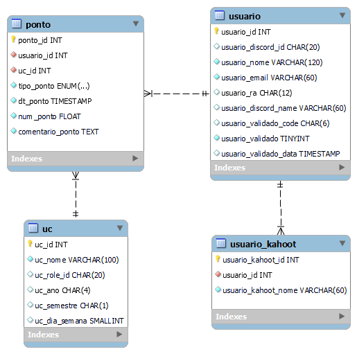

# pyAnimaGamification

Um sistema flexível desenvolvido para ajudar o **Prof. Henrique Poyatos** a administrar a **gamificação em sala de aula digital** e interagir melhor com seus alunos.

Este projeto foi construído utilizando a metodologia **Vibe Coding**, com o apoio da IDE **Google Antigravity** e do modelo de IA **Gemini LLM 3.1**. A plataforma rastreia a participação, frequência e engajamento dos usuários (alunos) nas Unidades Curriculares (UCs) e oferece tanto uma **API RESTful** completa (ideal para integrações como Bots do Discord) quanto uma **Interface Web (UI)** integrada.
## 🚀 Principais Funcionalidades

- **Gerenciamento de Usuários (Alunos):**
  - Cadastro detalhado de alunos (Nome, RA, e-mail).
  - Integração com o Discord por meio do armazenamento de `discord_id` e `discord_name`.
  - Controle de processo de validação de contas e mapeamento de múltiplos "apelidos" (aliases) que o aluno utiliza no Kahoot (`usuario_kahoot`).
  
- **Gerenciamento de Unidades Curriculares (UCs):**
  - Registro de disciplinas contemplando dados vitais como ano, semestre e dia da semana.

- **Sistema de Pontuação e Gamificação:**
  - O coração do sistema. Permite a atribuição de pontuação individualizada por tipo:
    - 🏫 **Presença**
    - 🗣️ **Participação**
    - 🎮 **Kahoot** (jogos de classe)
    - 📚 **Curso** (atividades extras)
  - Tudo pode conter comentários de justificativa e é interligado via o relacionamento Usuário ↔ UC.

- **Interface Frontend (UI) e Backend (API):**
  - **API:** Rotas `/api/usuarios`, `/api/ucs`, `/api/pontos`, etc., prontas para consumo por bots e outras aplicações.
  - **UI (Visão Administrativa/Usuario):** Rotas nativas sob o `/ui` ou raiz para manipulação dos dados diretos pelo navegador.

## 🗄️ Estrutura do Banco de Dados

O banco de dados relacional atua em torno de 4 entidades principais.



## 🛠️ Como Executar o Projeto

A aplicação está configurada para rodar nativamente via contêineres Docker, simplificando bastante a inicialização sem poluir o ambiente local com dependências.

### Pré-requisitos
- [Docker e Docker Compose](https://www.docker.com/) instalados em sua máquina.

### Executando Localmente
1. **Configuração de Variáveis de Ambiente:**
   Crie ou edite o arquivo `.env` na raiz do projeto contendo as credenciais de acesso ao seu banco de dados MySQL (`DB_USER`, `DB_PASSWORD`, `DB_HOST`, `DB_PORT`, `DB_NAME`). 
   *(Nota: Se essas variáveis não forem providenciadas, a aplicação fará o fallback (queda) segura para um banco de dados SQLite em memória temporário).*

2. **Subindo a Aplicação:**
   Rode o comando do docker-compose no terminal para compilar a imagem principal e iniciar a aplicação:
   ```bash
   docker-compose up --build
   ```

3. **Acessando no Navegador ou via cURL:**
   - A Aplicação / UI Web iniciará por padrão na porta **5001**.
   - **Healthcheck:** `http://localhost:5001/health`
   - **Endpoints da API Exemplos:** `http://localhost:5001/api/usuarios`
